# Legacy repository audit

Date: 2026-07-19
Scope: commit `68ee565` on `master`, before modernization documentation was added
Status: baseline evidence for the rebuild

> Repository update: commit `ed71652` subsequently relocated all 1,450 tracked baseline files into `legacy/` as exact renames with no content changes. Measurements and observations below describe commit `68ee565`; paths should now be read relative to `legacy/` unless historical root placement is the subject.

## Executive assessment

Dredmorpedia is a capable 2011-era client-rendered encyclopedia whose strongest asset is its encoded domain knowledge: it understands many Dungeons of Dredmor XML conventions and connects items, recipes, skills, spells, monsters, stats, templates, expansions, and mods. It is not a deployable modern application from a fresh clone.

The most important modernization problem is the data boundary. The committed repository intentionally excludes the proprietary base-game and expansion databases and most official assets. A fresh checkout therefore loads a mostly empty site without telling the user what is wrong. The rebuild needs an explicit, deterministic, testable import pipeline before it needs a new component library.

The legacy UI and parser are tightly coupled through mutable globals, asynchronous browser XML requests, numeric IDs created at runtime, inline templates, and whole-dataset DOM rendering. Reusing the behavioral rules is valuable; porting this architecture is not.

## Method

The audit combined:

- repository, Git history, ignored-file, file-count, and size inspection;
- static review of all 19 first-party JavaScript files, `index.html`, the primary stylesheet, source declarations, and representative XML/assets;
- XML well-formedness validation across every committed `.xml` file;
- entity counts for committed mod database files;
- a local Chromium runtime check from a clean checkout at desktop and 390 px mobile widths;
- primary-source review of current framework/runtime capabilities for the separate architecture proposal.

This was not a copyright determination, a security penetration test, or a pixel-by-pixel catalog of 1,239 PNG files.

## Repository snapshot

| Measure | Observed baseline |
| --- | ---: |
| Tracked files | 1,450 |
| Working-tree files excluding `.git` | 1,450 |
| Working-tree size excluding `.git` | 9,200,951 bytes |
| PNG files | 1,239 (3,687,888 bytes) |
| XML files | 83 (1,331,314 bytes) |
| JavaScript files | 33 (683,630 bytes) |
| First-party JavaScript | 19 files, 6,170 lines, 8 XML AJAX loaders |
| Vendored JavaScript | 14 files, about 531 KB |
| CSS files | 4 |
| HTML entry points | `index.html`, `404.html` |
| Git history visible in this fork | 15 commits, 2015-07-09 through 2022-10-25 |
| Automated tests / CI workflows | 0 / 0 |
| Package/build manifest | none |
| Repository license file | none |

Most repository bytes are historical mod packages and art/source assets. Several folders also include `.xcf`, `.psd`, `.db`, `.spr`, `.wav`, `.onetoc2`, `Thumbs.db`, and `.OLD` artifacts. They are useful provenance evidence but are not an intentional web-asset pipeline.

## What the application currently does

| Area | Legacy behavior | Important details |
| --- | --- | --- |
| Items | Categorizes and renders equipment, food, booze, traps, wands, potions, mushrooms, gems, reagents, and fallbacks | Parses prices, quality, stats, triggers, icons, and crafting links |
| Crafts | Groups recipes by tool | Handles hidden recipes, inputs, outputs, quantity, and skill requirement |
| Encrusts | Groups encrusting recipes by tool | Similar parser/render path to crafts; no committed encrust database is present |
| Skills | Groups skills by warrior/rogue/wizard archetype and renders abilities | Parses loadouts, ability stats, and referenced spells; the source still has a `TODO` for a formal link pass |
| Spells | Categorizes by initial character and renders effects | Encodes a large set of effect types, triggers, targets, recursion, buffs, mines, summons, item effects, and stat scaling |
| Monsters | Groups normal monsters by depth plus special monsters | Supports inheritance, level-derived stats, spells, drops, taxonomy, and palette tinting |
| Stats | Lists hard-coded damage, resistance, primary, and secondary definitions | Also supplies parsing maps and level formulas used by other modules |
| Templates | Renders targeting/area templates | Uses anchors and a grid-like representation |
| Meta | Shows a top-ten monster physical-damage calculation | Only one derived view exists |
| Search | Text search and stat-based ranking | Text omits crafts and monsters despite result tabs; the feature is marked incomplete in the changelog |
| Mods/sources | Enables base game + three DLC and lets users toggle ten bundled mods | Preferences are cookies; applying them reloads the page |
| Navigation | Hash references, nested tabs, highlighted rows, cloned-row tooltips | Runtime-generated numeric IDs make durable links fragile |

## Data sources and committed data

`Dredmor.Source.List` declares 14 sources:

- base game plus Realm of the Diggle Gods, You Have To Name The Expansion Pack, and Conquest of the Wizardlands;
- Wind Magic, Essential DoD I, Essential DoD II, Swift Striker, Interior Dredmorating, Rune Caster, Dire Gourmand, Roguish Renovation, FaxPax, and Chronomancy.

The `.gitignore` intentionally keeps only `mod.xml` for each official game source. All official `itemDB.xml`, `craftDB.xml`, `encrustDB.xml`, `skillDB.xml`, `spellDB.xml`, `monDB.xml`, and `manTemplateDB.xml` files are absent. The README instructs a developer to copy these and related proprietary folders from a local game installation and manually apply `sed` substitutions.

The committed mod database subset contains:

| Database | Files | Parsed entity count | Notes |
| --- | ---: | ---: | --- |
| `itemDB.xml` | 7 | 307 items | All well-formed |
| `craftDB.xml` | 4 | 202 crafts | All well-formed |
| `encrustDB.xml` | 0 | 0 encrusts | No fixture or mod source coverage |
| `skillDB.xml` | 9 | 24 skills, 192 abilities | Wrapper element conventions vary |
| `spellDB.xml` | 10 | 448 spells in the 9 valid files | Wind Magic file is invalid XML |
| `monDB.xml` | 5 | 14 monsters | Room XML contains other monster references but is outside the current encyclopedia parser |
| `manTemplateDB.xml` | 5 | 7 templates | Sparse coverage |

All 83 XML files were inspected: 82 are well-formed. `windmagic/mod/spellDB.xml` fails XML parsing at line 167 because an XML comment contains `--`. The legacy loader swallows the request/parser failure, so the source simply disappears.

## Current architecture and data flow

```mermaid
flowchart LR
    A["14 hard-coded sources"] --> B["8 browser AJAX loaders per active source"]
    B --> C["jQuery XML traversal"]
    C --> D["Mutable Dredmor.* global maps and arrays"]
    D --> E["Second link/derive pass"]
    E --> F["Inline JsRender templates in index.html"]
    F --> G["All entity rows inserted into one DOM"]
    G --> H["jQuery UI tabs, hash history, cookies, tooltips"]
```

Each section registers `Parse`, `Link`, and `Render` functions. `Dredmor.Section.Load` starts parsing for every section/source combination, waits for callbacks, runs all link functions, then renders. A cooperative queue yields after roughly 500 ms to keep older devices responsive.

Domain records are plain mutable objects in global maps/arrays. Cross-links are often still stored as names, then resolved at render time. `genId()` supplies monotonically increasing numeric IDs for sources, categories, entities, and DOM anchors.

### Correctness implications

- AJAX requests are initiated in a sequence but complete asynchronously. Map assignments such as `Item.Data[item.name] = item` and equivalent spell/monster/template assignments mean duplicate/override precedence can depend on response timing.
- Runtime IDs also depend on parse completion order. Deep links can change across reloads, source combinations, or network timing.
- Missing files and parse errors call the same completion callback as success and expose no diagnostic state to users.
- Some rules are distributed between parse code, render helpers, and templates, which makes it hard to test derived behavior without rendering the whole application.
- Source collision, unknown tag, dangling reference, and asset fallback behavior is neither summarized nor persisted.

## Runtime findings from a clean checkout

The legacy site was served unchanged from the repository root and allowed to finish initialization.

- Items, crafts, encrusts, skills, spells, monsters, and templates each rendered zero rows because official databases were absent and mods default to disabled.
- Stats rendered 63 hard-coded rows; Meta rendered its one hard-coded block.
- The UI reported no error or missing-data explanation. Browser console warnings/errors were empty because AJAX error callbacks intentionally suppress failures.
- The document has 12 top-level tabs and initially selects the empty Items view.
- No `lang` attribute, viewport meta tag, or `main`/`nav`/`header`/`footer` landmark exists.
- The empty-data runtime still contained 192 images without `alt` attributes. Several icon-only stat controls are click handlers on non-interactive elements.
- At an effective 375 px content viewport, the document measured 1,007 px wide. `#page` is fixed at 1,000 px, the stylesheet has no media queries, and `body { overflow-x: hidden; }` conceals rather than solves overflow.

The manifest is nominal: it has an empty `short_name`, absolute icon paths, and no corresponding service worker/offline strategy.

## Legacy dependency profile

All dependencies are checked-in scripts loaded globally; there is no lockfile, dependency graph, update mechanism, or automated license/vulnerability report.

Notable components include:

- jQuery 1.6.4 and jQuery UI 1.8.16;
- a `JsRender v1.0pre` build plus an unused older copy;
- jQuery History, Cookie, Tooltip, and BlockUI plugins;
- CamanJS for palette tinting;
- SWFObject 2.2 and Downloadify 0.2 for a Flash-based export tool that is not loaded by the current page;
- an apparently unused compiled table-filter library.

The application uses APIs such as `.live()` and old jQuery UI tab-selection signatures. Modernizing these libraries in place would be a rewrite with little architectural benefit.

## Quality, performance, accessibility, and security

### Quality and operability

- No unit, parser fixture, integration, browser, or snapshot tests exist.
- No build, lint, formatting, type checking, development server, or CI configuration exists.
- The README setup depends on manual copying, manual path substitutions, unpacking sprites, and obsolete deployment commands.
- Deployment documentation targets direct Google Cloud Storage or S3 synchronization with long exclusion expressions.
- No structured error model, data-quality report, or versioned generated artifact exists.

### Performance and discoverability

- Browsers fetch and parse raw XML on every uncached load; the page explicitly disables caching.
- Every rendered record is inserted into a single application page, making startup, memory, DOM, tooltip, and search cost scale with the full dataset.
- Search scans live global objects and clones already-rendered table rows after a one-second debounce.
- Hash-only client rendering gives entities no independent HTML document, title, metadata, or stable search-engine URL.

### Accessibility and responsive design

- Fixed-width table layouts, image-only indicators, small base text, click-only stat icons, and missing alternative text are widespread.
- The page lacks a mobile viewport declaration, semantic page landmarks, and a document language.
- Old tabs/tooltips may provide some generated ARIA state, but the application has no stated WCAG target or automated/manual accessibility checks.

### Security and trust boundaries

The current site has no backend, authentication, or secrets, which limits impact. However, XML strings and source metadata feed inline templates and HTML-building helpers, including `.html()`/`.append()` paths, without a clear centralized escaping policy. That becomes a meaningful cross-site scripting boundary if local uploads, third-party mods, or community data are added. External links opened with `target="_blank"` also lack modern opener protection, and many source links still use HTTP.

The rebuild should treat every imported file as untrusted, validate paths against allowed roots, reject traversal, escape rendered text by default, and keep raw markup out of normalized records.

## Legal and provenance constraints

- There is no root license for the application code.
- Official game databases/assets are excluded, strongly suggesting they should not be assumed redistributable.
- Bundled mods and source-art files do not share an obvious repository-level license.
- The current README attributes the original 2011 version to J-Factor and later fork work to other contributors, but attribution is not a replacement for a license.

Before a public rebuild ships, the owner should determine what code and content can be redistributed, what must be imported locally, and what attribution is required. This audit flags the question; it is not legal advice.

## What should be preserved

- The entity taxonomy and the broad set of XML parsing rules.
- Stat definitions, formulas, monster inheritance behavior, and spell-effect vocabulary after verification with fixtures.
- Cross-domain relationships: crafting inputs/outputs, skill-to-spell, spell recursion, summons, drops, templates, and source provenance.
- Source/mod layering as a product concept, with deterministic precedence and visible diagnostics.
- The distinctive paper/metal visual identity as design inspiration, subject to asset rights.

## What should be replaced

- Browser-time XML parsing and silent error handling.
- Mutable globals, request-order overrides, and runtime numeric anchors.
- The one-page nested-tab information architecture.
- Whole-dataset rendering, DOM-clone search, and cookie-driven reloads.
- Vendored legacy libraries, Flash paths, cache-busting query strings, and manual deployment scripts.
- Inline HTML construction with ambiguous escaping.

## Prioritized risk register

| Priority | Risk | Consequence | Required response |
| --- | --- | --- | --- |
| P0 | Official data and redistribution model unresolved | A public build may be empty or legally unsafe | Decide import/publish policy before deployment architecture is finalized |
| P0 | Non-deterministic duplicate/override precedence | The same sources can produce different records/links | Define ordered source precedence and collision diagnostics in a pure pipeline |
| P0 | Missing/invalid data is silent | Users cannot distinguish “no results” from “broken install” | Make pipeline/build diagnostics and UI dataset status first-class |
| P1 | No tests or fixtures | Parser ports can silently lose domain rules | Build synthetic fixtures and characterization tests before broad parity work |
| P1 | Tight parser/domain/UI coupling | Rewrite risk and slow iteration | Split pipeline, domain graph, and web layers |
| P1 | Fixed 1,000 px, all-DOM UI | Poor mobile experience and scaling | Route per entity, responsive cards/tables, pagination/virtualization as measured |
| P1 | Unclear escaping for imported text | Mod import could become an XSS vector | Validate untrusted input and render text escaped by default |
| P1 | No code/content license | Distribution and contribution uncertainty | Complete provenance/license audit and add repository policy |
| P2 | Nominal PWA and obsolete deploy path | Misleading capability and fragile releases | Reintroduce offline/installability only after core static build is sound |

## Unknowns to resolve during discovery

- Exact official dataset size and all schema variants across the supported game version/DLC.
- Current public-domain ownership and hosting expectations for `dredmorpedia.com`.
- Whether users need browser-side local import, maintainer-side build import, or both.
- Which legacy calculations are accurate versus merely historical approximations.
- Asset and code licenses for the upstream site and each bundled mod.
- Desired parity boundary and first high-value feature slice.
