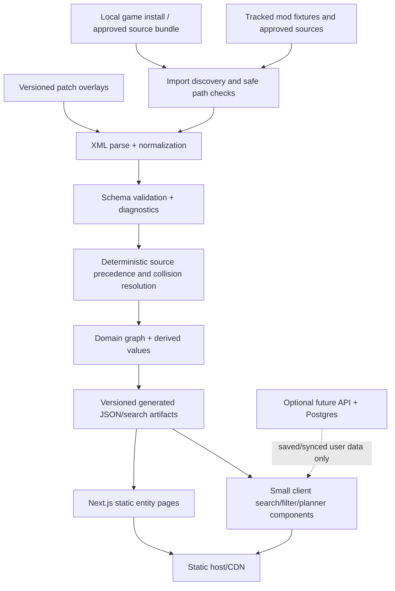

# Modernization proposal

Date: 2026-07-19
Status: owner-approved direction; technical spike validated, publication policy pending

## Recommendation in one sentence

Build a pnpm TypeScript workspace with a deterministic Node-based XML/data pipeline, a framework-independent domain package, and a Next.js App Router web application that is statically exported first and can adopt server-backed features later without replacing the UI platform.

This is proposed in [`../decisions/0001-platform-and-repository-direction.md`](../decisions/0001-platform-and-repository-direction.md). The owner approved the platform direction, and the synthetic plus read-only full-dataset spike validated its technical checklist. The ADR remains proposed because restricted data and asset publication are independently gated by [`../data-and-assets-policy.md`](../data-and-assets-policy.md). Measurements are recorded in [`../analysis/architecture-spike-2026-07-19.md`](../analysis/architecture-spike-2026-07-19.md).

## Why this shape fits Dredmorpedia

The application is mostly reference content with rich relationships and a smaller interactive tool layer. It benefits from prebuilt HTML for entity pages, low JavaScript for reading, structured metadata, and inexpensive hosting. It also has credible future features—build planning, comparisons, mod import/validation, saved favorites, and shareable configurations—that benefit from React and an optional full-stack path.

The data pipeline is the key architectural boundary. Moving XML parsing to a controlled build/import step makes output deterministic, enables schema and relationship diagnostics, avoids shipping raw source files to every browser, and lets tests cover domain behavior without rendering the UI.

Current Next.js documentation explicitly supports starting with static export and later adopting server-required features. App Router Server Components run during a static build, dynamic entity routes can be enumerated with `generateStaticParams`, and interactive Client Components can remain small and local. See [Static Exports](https://nextjs.org/docs/app/guides/static-exports), [generateStaticParams](https://nextjs.org/docs/app/api-reference/functions/generate-static-params), and [Server and Client Components](https://nextjs.org/docs/app/getting-started/server-and-client-components).

## Decision drivers

1. Deterministic parsing, overrides, relationships, IDs, and diagnostics.
2. A clean legal boundary between code, locally imported game data, generated artifacts, and redistributable public content.
3. Static, searchable, indexable entity pages with fast first loads.
4. Strong TypeScript tooling and a large ecosystem for data-heavy interactive tools.
5. A single documented setup that works well for a human maintainer and coding agents.
6. Progressive growth: no database or server required for the initial encyclopedia, but neither should require a second frontend rewrite later.
7. Testability at parser, domain, page, accessibility, and end-to-end levels.

## Confirmed owner constraints

- Deliver useful vertical slices in dependency order, but retain complete functional/content parity with the legacy application as the first release target.
- Support the base game and all three official expansions first; keep mod support possible without prioritizing broad mod coverage.
- Use a modern visual language inspired by Dungeons of Dredmor rather than reproducing the legacy page.
- Use Tailwind CSS with project-owned tokens, selectively adopted shadcn/ui components backed by Base UI, and light/dark/system themes.
- Ship in English initially; defer localization infrastructure and translated game content until a maintained translation source exists, while keeping canonical source text separate from interface copy.
- Keep the initial deployment static and compatible with free hosting, with GitHub Pages as the leading candidate.
- Design the data model for rich filters and crafting/encrusting backlinks. Defer favorites/lists persistence details and live game tracking until their own decisions or research.

## Proposed target architecture



### Boundary rules

- The web application consumes normalized artifacts or domain APIs; it never parses raw game XML.
- The pipeline imports no React/Next code and can run in tests or a CLI.
- Domain calculations and graph linking are pure TypeScript wherever practical.
- Raw inputs and generated output are separate. Generated records preserve input provenance and patch history.
- Diagnostics are data, not console noise: every run emits counts, warnings/errors, duplicate decisions, dangling references, unsupported tags/attributes, and missing assets.

## Recommended stack

| Layer | Recommendation | Why | Introduce |
| --- | --- | --- | --- |
| Runtime | Node.js 24 LTS, pinned in repository metadata | Production projects should use an Active or Maintenance LTS line; v24 is LTS as of this proposal | Foundation |
| Workspace | pnpm with a pinned `packageManager` and workspace lockfile | Fast deterministic installs, straightforward package boundaries, good monorepo ergonomics | Foundation |
| Language | TypeScript in strict mode | Replaces undocumented object shapes with checked contracts and makes agent/human refactors safer | Foundation |
| Web | Current stable Next.js App Router + React | Static generation, route metadata, Server/Client boundaries, React ecosystem, optional server path | Foundation |
| Styling and components | Tailwind CSS plus CSS custom-property design tokens; selectively copied shadcn/ui components; light/dark/system themes; selective CSS modules for complex themed components | Provides consistent, editable component starting points without surrendering the custom Dredmor visual language | Architecture spike / first vertical slice |
| Accessible primitives | Native HTML where sufficient; Base UI-backed shadcn/ui components for complex behavior | Reuses maintained keyboard, focus, and ARIA behavior while keeping semantics and styling under project control | Architecture spike / as needed |
| XML | `fast-xml-parser` behind a project-owned adapter, confirmed by a parser spike | Node-compatible, but the adapter prevents library-specific shapes from leaking into the domain | Pipeline spike |
| Validation | Zod at import/artifact boundaries plus TypeScript domain types | Runtime input is untrusted and irregular; compile-time types alone are insufficient | Pipeline spike |
| Search | Generated compact text index plus project-owned structured filters; evaluate MiniSearch against real dataset size | Search must understand entity type, source, stats, relationships, and numeric filters, not only page text | Items/search slice |
| Unit/integration tests | Vitest | Fast TypeScript tests for parser fixtures, source precedence, graph linking, calculations, and components | Foundation |
| Browser tests | Playwright with `@axe-core/playwright` | Cross-browser flows plus automated detection of common accessibility failures | First vertical slice |
| Formatting/linting | Prettier, ESLint, TypeScript checks | One canonical style and machine-verifiable boundaries | Foundation |
| CI | GitHub Actions | The repository is already on GitHub; run install, audit, format, lint, typecheck, unit, build, and smoke jobs | Foundation |
| Deployment | Static export to a CDN/static host; validate GitHub Pages first, then choose based on rights, domain, preview, and header requirements | Lowest operational cost and broad portability | Architecture spike / release preparation |
| Database/auth | None initially; Postgres + a managed auth adapter only when synchronized user features are approved | Avoids operational complexity that core reference content does not need | Later, if justified |

Use current compatible package versions when scaffolding and commit the lockfile. Do not copy version numbers from this dated proposal except the chosen Node LTS line. The Node project’s [release policy and status table](https://nodejs.org/en/about/previous-releases) are the source of truth.

### Why Tailwind plus selective shadcn/ui components

The legacy identity is unusually specific: parchment, metal, stat colors, pixel icons, dense game data, and comparison tables. A closed, themed component suite would be fought as often as it helps. Tailwind and tokens provide consistent spacing and responsive behavior, while shadcn/ui provides editable component source rather than an opaque theme dependency. Use its Base UI-backed variants for controls such as dialogs, comboboxes, menus, tabs, popovers, and tooltips whose keyboard and focus behavior is difficult to implement correctly. Add components only when a product slice needs them, keep them in the web boundary, and treat the copied source as maintained project code.

Accessible primitives reduce risk; they do not make the completed interface automatically accessible. The application must still supply semantic page structure, labels and descriptions, visible focus, sufficient contrast, usable responsive layouts, and keyboard and assistive-technology verification.

### Initial language scope

The first release is English-only because the canonical game content is English and there is no maintained translation source. Do not add localized routes, translation catalogs, or a language selector during the architecture spike. Keep application interface copy separate from imported source text, use UTF-8 and a correct document language, format user-facing numbers through `Intl`, and keep stable IDs and canonical routes independent of localized display strings. If translations become viable later, translate the interface separately and represent translated game content as a provenance-bearing overlay rather than overwriting canonical English records.

### Search approach

Do not render every record and search the DOM. At build time, emit:

- a compact text document per entity containing normalized name, aliases, description, source, and selected relation labels;
- structured facets such as entity kind, source, item category, skill archetype, monster depth/taxonomy, and stat IDs;
- numeric fields required for comparison/range queries;
- canonical URLs and display summaries.

Load the text index only on routes that need it. Apply structured filters against typed records rather than encoding game rules in a third-party query syntax. Measure artifact and query size with the complete dataset before committing to a search library or web worker.

## Data pipeline design

### Stages

1. **Discover** an allowed source root without following paths outside it.
2. **Identify** game version, DLC, mods, and source order from an explicit manifest.
3. **Parse** XML into loss-aware intermediate nodes through one adapter.
4. **Normalize** casing, numbers, booleans, inconsistent attribute aliases, paths, and known wrapper elements.
5. **Validate** entity contracts and record unsupported constructs rather than silently discarding them.
6. **Patch** known upstream defects with small versioned overlays that explain why they exist.
7. **Resolve** duplicate/collision precedence from the manifest, never filesystem or asynchronous completion order.
8. **Link** references in a second deterministic pass and retain unresolved references as diagnostics.
9. **Derive** totals, recipe backlinks, spell graphs, rankings, and search documents through pure functions.
10. **Emit** versioned artifacts, a manifest/checksum, and a human/machine-readable audit report.

### Identity and provenance

Keep two identities where sources can override one another:

- a source-scoped record ID such as `spell:faxpax:stormbolt`;
- a canonical key/slug used to resolve the active dataset and stable public URL.

Every record should include at least `sourceId`, `sourcePath`, `originalKey`, `canonicalKey`, and `diagnosticIds`. Collision resolution should retain losing variants for provenance and mod comparison rather than overwriting them.

### Input/output policy

Proposed local layout after scaffolding:

```text
data/
  README.md              # legal/setup instructions
  raw/                   # gitignored local imports
  patches/               # tracked, small, explained overlays
  generated/             # gitignored or CI artifact until publication rights are clear
fixtures/
  synthetic/             # tracked minimal test XML/assets
```

Whether any generated dataset can be committed or deployed is a product/legal decision, not a build-tool default.

## Proposed workspace layout

```text
apps/
  web/                   # Next.js routes, components, metadata, public assets
packages/
  domain/                # types, relationships, calculations, queries
  data-pipeline/         # CLI, parsers, normalizers, validators, emitters
  search/                # index document generation and client query adapter
fixtures/
  synthetic/
data/
  patches/
legacy/                  # preserved runnable behavioral reference
docs/
scripts/
```

The owner chose to move the current root application into `legacy/` as the first implementation change so the new workspace and licensing boundary start cleanly. Keep the relocation isolated, preserve the legacy contents, verify it from `legacy/` as the document root, and retain it until replacement parity is demonstrated.

## Route and rendering model

Proposed public routes:

```text
/
/search
/items
/items/[slug]
/recipes
/recipes/[slug]
/encrustments/[slug]
/skills/[slug]
/spells/[slug]
/monsters/[slug]
/stats/[slug]
/templates/[slug]
/sources/[slug]
/tools/compare
/tools/build-planner
/tools/crafting-graph
/tools/mod-inspector
/about/data
```

Entity pages are static Server Components generated from normalized data. Search controls, source filters, comparisons, and planners are bounded Client Components. Filters and selections should live in URL search parameters when shareability matters. Persistence for tags, favorites, lists, and other local state remains a later product decision rather than an architectural assumption.

Static export limitations are acceptable for the initial scope: server actions, runtime headers, ISR, and the default image optimizer are unavailable in that mode. If synchronized accounts or private imports become real requirements, remove static export and deploy the same App Router application to a supported server runtime rather than redesigning the frontend.

## Testing strategy

### Pipeline characterization

- Synthetic XML fixtures for every supported entity and representative spell effect.
- Alias/casing/boolean/number/path variants observed in official and mod sources.
- Duplicate precedence and deterministic artifact snapshot tests.
- Invalid XML, unknown tag, dangling reference, missing asset, and traversal rejection tests.
- Golden calculations for stat parsing, monster inheritance, and derived values.

### Web and accessibility

- Component tests for dense data presentations and responsive state changes.
- Playwright smoke flows for search, entity navigation, source filters, shareable URLs, and tool persistence.
- Automated axe scans on representative routes, plus keyboard/manual checks. Playwright’s own guidance notes that automated checks catch only a subset and should be combined with manual assessment: [Accessibility testing](https://playwright.dev/docs/next/accessibility-testing).
- Build assertions for unique titles/descriptions, canonical URLs, broken links, and generated route counts.

## Feature opportunities

### High-value foundation features

- Fast global search with type/source/stat filters and keyboard navigation.
- Cross-list filters for domain-specific fields such as crafting-skill level.
- Stable entity pages with backlinks and an explicit “why is this value shown?” provenance panel.
- Explicit “used to craft” and “used to encrust” relationships on relevant entities.
- Side-by-side comparisons for items, skills, spells, and monsters with delta highlighting.
- Source/version selector that explains overrides and missing data instead of reloading blindly.
- Dataset health page showing source versions, parse warnings, collisions, dangling links, and asset coverage.

### Distinctive next features

- **Build planner:** choose seven skills, calculate archetype/level stats, browse granted abilities, and share the build URL.
- **Crafting dependency graph:** answer “how do I make this?” recursively, calculate base reagents, and detect cycles/substitutions.
- **Mod inspector:** import a mod locally, validate it, show added/overridden entities, and explain conflicts without uploading proprietary files.
- **Effect explorer:** visualize spell trigger chains and recursive effects with cycle protection.
- **Monster encounter calculator:** compare defenses/damage against a planned build and dungeon depth.
- **Data diff:** compare game/source versions or two mod sets at the entity and field level.
- **Offline reference:** installable cached core pages/search after artifact size and asset rights are known.

### Later, only with evidence

- Synced favorites/builds, accounts, community annotations, public APIs, interface localization, translated-content overlays, and collaborative mod catalogs.
- These introduce privacy, moderation, persistence, abuse prevention, and operating costs; they should not be bundled into the initial rebuild.

## Alternatives considered

### Astro

Astro is the strongest alternative if the product is intentionally kept as a mostly read-only static encyclopedia. It defaults to static output, can prerender dynamic routes, supports typed content collections/loaders, and can opt individual routes into on-demand rendering. See Astro’s [configuration](https://docs.astro.build/en/reference/configuration-reference/), [routing](https://docs.astro.build/en/reference/routing-reference/), and [content collections](https://docs.astro.build/en/guides/content-collections/) documentation.

Why it is not the primary recommendation: Dredmorpedia’s likely differentiators are interactive structured tools rather than editorial content. Standardizing those on React inside Next gives a more direct path to planners, comparisons, local imports, and later server functions. Revisit Astro if the owner prioritizes the smallest possible static content runtime and defers most tools.

### React + Vite single-page application

This has the lowest framework learning/setup cost, but it tends to recreate the legacy weaknesses: a client bootstrap, client data loading, no independently generated entity documents by default, and more bespoke routing/metadata work. It remains a good choice for a separate local-only mod inspector, not the preferred public encyclopedia shell.

### Incremental jQuery/library upgrade

Rejected. The old APIs, global data model, inline templates, and browser parser are the coupling problem. Updating jQuery would require broad changes without producing typed domain boundaries, deterministic artifacts, stable routes, or modern testing.

### Database-first SSR application

Rejected for the initial release. Core data changes at build/import time and can be emitted statically. A database adds migrations, hosting, backups, query layers, and operational failure modes before accounts or collaborative data justify it.

## Decisions required from the owner

1. Define the public generated-data and asset redistribution policy.
2. Define acceptance criteria for the first parity slice: recommended `items + stats + source provenance + search`, with crafting/encrusting backlinks immediately after.
3. Define search response-time and relevance acceptance criteria for ADR 0003.
4. Prioritize the first post-parity quality-of-life feature; keep live tracking in a separate later research decision.
